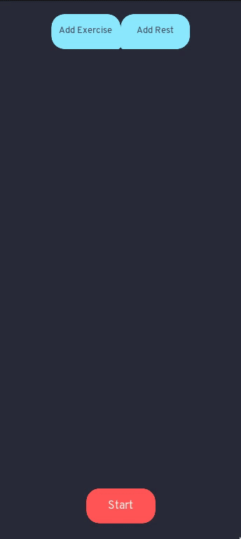

# README

An assistant that I made to help myself keep track of my routine using timers and convenience in general.

## Installing

1. Clone this repository.
2. Import it into Godot.
3. Export it into your platform of choice (Linux, Android, etc...).
